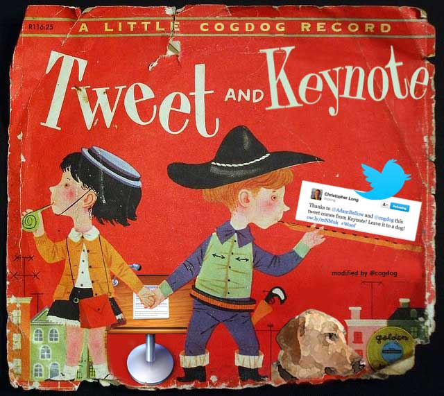

# Keynote rTweet
v 1.0 by Damon Kiesow @diesow
Supports use of rtweet by @kearneymw and threaded tweets

Based entirely on Keynote tweet v. 2.7.1 by Alan Levine http://cogdog.info/ or http://cogdogblog.com/
His notes and background on the project are below

-----
*If this kind of stuff has any value to you, please consider supporting me so I can do more!*

 

----- 

A MacOS X script (formerly known as AppleScript) for allowing presenters to automatically send tweets from specified slides in a Keynote slide deck.

## Back Story

It was started by Ideo Labs (?) and was hosted here: http://code.google.com/p/keynotetweet/  Twitter changed its authentication method, broke the posting method, and it wasn't updated. Splatdot.com updated to use a different posting technique to use a command line tweeting tool http://splatdot.com/the-oauthpocalypse-and-keynote-tweet/ Toby Harris built it into an app That Just Worked https://github.com/tobyspark/Keynote-Tweet

I [blogged about my method for getting it to work](http://cogdogblog.com/2011/02/keynote-tweet/) and did a fair number of tweeting presentations. Then it broke when Twitter changed their API to version 1.1. I managed to fix the app by [simply by changing a decimal place in the script](http://cogdogblog.com/2013/06/leave-it-to-a-dog-to-fix-the-keynote-autotweeter/).

Alas, for a number of years, Tweeting from Keynote was not possible due to the way Apple changed the ways scripts could interact with Keynote, and It Just Did Not Work for new operating systems (Yosemite and on to Sierra).

Thanks to a suggestion from Amy Webb, I was able to modify the script into a version that works on my test machine of Yosemite and hers on High Sierra.

I think it works.

## Setting Up to Tweet

To do this you will need to create an "app" in twitter to get  authentication keys necessary for letting your computer send out tweets. Go to https://apps.twitter.com/ and Create a New App.

Here you will create a new “app” which really means, you are just going to set up something so twurl on your computer can communicate to twitter through your account.

The information you enter here does not matter much since no one really sees it, but create a name like Jenny’s Keynote Tweet Machine, use your blog URL or some URL. 

That is all the information twitter needs from you but you need two key pieces of information from twitter.

Click on the **Keys And Access Tokens** tab. Make sure the app has rights to `Read and Write`. Then copy the two cryptic looking mumbo jumbo strings for **Consumer Key (API Key)** and **Consumer Secret (API Secret)** and save them somewhere you can use later when you have to authenticate in twurl (below).

You will need to do some command line stuff, but it's not horrific. You need to install a program called `twurl` that allows your Mac to send tweets. See the instructions from here:

    http://github.com/marcel/twurl
    
Test twurl from your command line:

    twurl /1.1/statuses/home_timeline.json
    
This should return a bunch of JSON/code looking stuff. Just make sure there are no errors. Then, for fun, use twurl to send a tweet:

    twurl -d 'status=Making sure twurl works because @cogdog told me to do this' /1.1/statuses/update.json

This should post a tweet from your account. Unless all this works, you can't tweet from Keynote.

## Getting the App

A compiled version of the Keynote Tweet app is included in this repo. If for some reason it does not run, you can easily build your own.

1. Open the [text version of the script](https://github.com/cogdog/Keynote-Tweet/blob/master/keynote-tweet-script.txt), select all, and copy.
2. In the **Utilities** folder of your Mac, launch the **Script Editor** and create a new one.
3. Paste the text of the script in. It will look all purple.
4. Click the **Compile** button at the top (looks like a hammer). The script text should now be colorized.
5. Click the **Run** button just for fun to see if you get the dialog prompt.
6. Save the app as any name you like; **Keynote Tweet 2.7.1** will let you know... that it is version 2.7.1

## Using Keynote Tweet

For any slides in Keynote you want to send a tweet, just open the Presenter Notes and put your tweet inside `[twitter]...[/twitter]` tags.

Now launch your Keynote Tweet app. It offers a dialog box which lets you add additional text to include e.g. hashtags. 
Play your presentation, and click through slides. Watch your twitter stream.

Your audiences will think you are endowed with great power and mystique. You are.

## "sh doesn't find twurl" errors

Awwww sh....

Without getting too deep into unix terminology, the script needs to know the full file path to the twurl program (despite the fact you do not need it running from the command line). It's a `shell` thing. The script and compiled app included here uses what should be the most common path for where twurl is installed.

      /usr/bin/twurl
      
It's possible it ended up somewhere else on your machine. You can find it's exact location by running from the command line:

     which twurl
     
and it should respond with a full path. If is different from above, you will have to edit the script, and compile it in the Apple Script editor. 

1. Open the [text version of the script](https://github.com/cogdog/Keynote-Tweet/blob/master/keynote-tweet-script.txt), select all, and copy.
2. In the **Utilities** folder of your Mac, launch the **Script Editor** and create a new one.
3. Paste the text of the script in. It will look all purple.
4. Look for the line that reads:

     do shell script "/usr/bin/twurl -d " & twitter_status & " /1.1/statuses/update.json"
     
5. Change the part that reads `/usr/bin/twurl`to whatever path the `which twurl` command returns.
6. Click the **Compile** button at the top (looks like a hammer). The script text should now be colorized.
7. Click the **Run** button just for fun to see if you get the dialog prompt.
8. Save the app as any name you like; **Keynote Tweet 2.7.1** will let you know... that it is version 2.7.1

Give it a try again.
     

## Blog Notes

See the long droll history of my tinkering with this http://cogdogblog.com/tag/keynote-tweet/

## Recent history

* v 2.7.1 Feb 4, 2018: Addressing the twurl no found by coding in the full expected path `/usr/bin/twurl` after reading [Apple Tech doc on path issues](https://developer.apple.com/library/content/technotes/tn2065/_index.html)

* v 2.7 Feb 4, 2018: Updated to try script command (h/t to @amywebb on twitter) that might work on High Sierra (I am only able to try on Yosemite for now, it works) Blogged http://cogdogblog.com/2018/02/keynote-tweet-sierra/

### Requests/Complaints/Kudos

I have no issues with issues...

* *You tell me* Fork and edit to suggest features or [toss them into the Issues bin](https://github.com/cogdog/Keynote-Tweet/issues)

